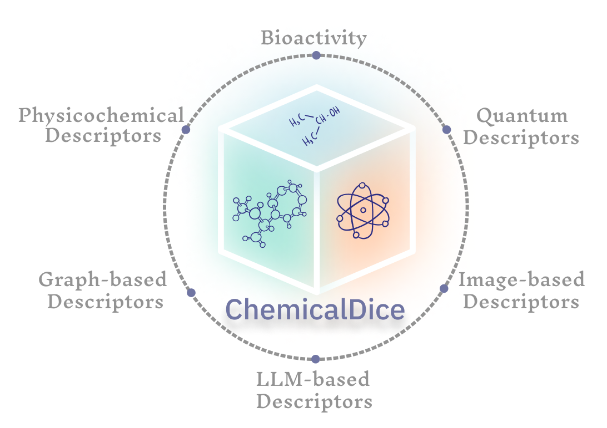

# ChemicalDice



ChemicalDice presents an innovative paradigm shift in cheminformatics
and bioinformatics, leveraging advanced feature fusion methodologies to
transcend traditional data silos. By ingeniously amalgamating disparate
data modalities---ranging from chemical descriptors and molecular
structures to omics data, images, and phenotype
information---ChemicalDice pioneers a transformative approach. Through a
rich arsenal of techniques including AER, PCA, ICA, IPCA, CCA, t-SNE,
KPCA, RKS, SEM, Autoencoders, Tensor Decomposition, and PLSDA,
ChemicalDice unlocks novel insights by unraveling the intricate
interplay between chemical and biological entities within complex
datasets. Its intuitive interface and comprehensive toolkit empower
researchers to seamlessly navigate through the complexities of
integrative analyses, heralding a new era of interdisciplinary research
and discovery.

Environment Setup
=================

To setup an Environment to run ChemicalDice you can install miniconda
using command.

``` {.bash}
wget https://repo.anaconda.com/miniconda/Miniconda3-latest-Linux-x86_64.sh
bash Miniconda3-latest-Linux-x86_64.sh
```

Follow the prompts after above commands to install conda. Make a
separate environment named chemdice using the conda create

``` {.bash}
conda create -n chemicaldice python=3.10
conda activate chemicaldice
```

Installation
============

To use the **ChemicalDice** package, you need to install it along with
its dependencies. You can install ChemicalDice and its dependencies
using the following command:

``` {.bash}
pip install -i https://test.pypi.org/simple/ ChemicalDice==0.3.2
pip install torch==2.2.1 torchvision==0.17.1 torchaudio==2.2.1 --index-url https://download.pytorch.org/whl/rocm5.7
pip install multitasking==0.0.11 pandas==2.0.3 scikit-learn==1.2.2 seaborn==0.13.1 tqdm==4.66.4 xgboost==2.0.3
pip install rdkit==2023.9.6 signaturizer==1.1.14 descriptastorus==2.6.1 mordred==1.2.0 tensorly==0.8.1 transformers==4.40.1
pip install --upgrade tensorflow==2.15
conda install conda-forge::openbabel
conda install conda-forge::cpulimit
```

This command installs Chemicaldice along with the required dependencies.
Make sure to have the appropriate versions of these packages compatible
with ChemicalDice.

Import
------

``` {.python}
from ChemicalDice import smiles_preprocess, bioactivity, chemberta, Grover, ImageMol, chemical, quantum
from ChemicalDice.fusionData import fusionData
from ChemicalDice.plot_data import plot_model_boxplot
from ChemicalDice.plot_data import plot_model_metrics
from ChemicalDice.plot_data import plot_models_barplot
```

Calculation of descriptors
--------------------------

``` {.python}
# create a directory for storing descriptors file 
import os
os.mkdir("data")


# download prerequisites for quantum, grover and ImageMol
quantum.get_mopac_prerequisites()

# input file containing SMILES and labels
input_file = "your_file_name.csv"

# preprocessing of smiles to different formats
smiles_preprocess.add_canonical_smiles(input_file)
smiles_preprocess.create_mol2_files(input_file)
smiles_preprocess.create_sdf_files(input_file)

# calculation of all descriptors
quantum.descriptor_calculator(input_file, output_file="data/mopac.csv")
Grover.get_embeddings(input_file,  output_file_name="data/Grover.csv")
ImageMol.image_to_embeddings(input_file, output_file_name="data/ImageMol.csv")
chemberta.smiles_to_embeddings(input_file, output_file = "data/Chemberta.csv")
bioactivity.calculate_descriptors(input_file, output_file = "data/Signaturizer.csv")
chemical.descriptor_calculator(input_file, output_file="data/mordred.csv") 
```

Reading Data
------------

Define data path dictionary with name of dataset and csv file path. The
csv file should contain ID column along with features columns. Label
file should contain id and labels. If these columns named properly (id
and labels) you can provide`id_column` and `label_column` argument
during initialization of `fusionData`.

``` {.python}
data_paths = {
    "tabular1":"data/Chemberta.csv",
    "tabular2":"data/Grover.csv",
    "tabular3":"data/mopac.csv",
    "tabular4":"data/mordred.csv",
    "tabular5":"data/Signaturizer.csv",
    "tabular6": "data/ImageMol.csv"
}
```

loading data from csv files and creating `fusionData` object.

``` {.python}
fusiondata = fusionData(data_paths = data_paths, label_file_path="freesolv.csv", label_column="labels", id_column="ID")
```

After loading data, you can use `fusionData` object to access your data
by `dataframes` dictionary in fusion data object. For example to get
tabular1 dataframe by the following code. This is important to look at
the datasets before doing any analysis.

``` {.python}
fusiondata.dataframes['tabular1']
```

Data Cleaning
-------------

### Common samples

Keep only samples (rows) that are common across dataset. This is
important if there is difference in set of samples across datasets.

``` {.python}
fusiondata.keep_common_samples()
```

### Empty Features removal

Features in data should be removed if there is higher percentage of
missing values. Remove columns with more than a certain percentage of
missing values from dataframes can solve this. The percentage threshold
of missing values to drop a column. `threshold` should be between 0 and
100. `ShowMissingValues` is function which prints the count of missing
values in each dataset.

``` {.python}
fusiondata.ShowMissingValues()
fusiondata.remove_empty_features(threshold=20)
fusiondata.ShowMissingValues()
```

### Imputation/Remove features

Imputation of data if the data have low percentage of missing values.
`ImputeData` is a function with takes a single argument which is method
to be used for imputation. The `method` can be "knn", "mean", "mode",
"median", and "interpolate".

``` {.python}
# Imputing values with missing values
fusiondata.ShowMissingValues()
fusiondata.ImputeData(method="knn")
fusiondata.ShowMissingValues()
```

Data Normalization
------------------

### Normalization/Standardization/Transformation

Data should be normalized before we proceed to fusion. There are three
functions which can be used for data normalization `scale_data`,
`normalize_data` and `transform_data`. These functions takes single
argument that is type of scaling/normalization/transformation.

``` {.python}
# Standardize data
fusiondata.scale_data(scaling_type = 'standardize')
```

scaling type can be one of these 'minmax' , 'minmax' 'robust' or
'pareto'

``` {.python}
# Normalize data
fusiondata.normalize_data(normalization_type ='constant_sum')
```

normalization types can be one of these 'constant_sum', 'L1' ,'L2' or
'max'

``` {.python}
# Transform data
fusiondata.transform_df(transformation_type ='log')
```

transformation_type can be one of these 'cubicroot', 'log10', 'log',
'log2', 'sqrt', 'powertransformer', or 'quantiletransformer'.

Data Fusion
-----------

Data fusion will take all the data that is normalized in previous step
and make a single fused data. This will result in a single dataframe
`fusedData` in the `fusionData` object.

    # fusing features in different data
    fusiondata.fuseFeatures(n_components = 10,  method="plsda")
    fused_dataframe = fusiondata.fusedData

Other methods available for fusing data are \'AER\', 'pca', 'ica',
'ipca', 'cca', 'tsne', 'kpca', 'rks', 'SEM', 'autoencoder', and
'tensordecompose', The argument number of components can be provided to
by `n_components` parameter to `fuseFeature` function.

Evaluation of fusion methods
----------------------------

### Simple evaluation

Data fused by different methods can be evaluated using different machine
learning models using `evaluate_fusion_models` function. This function
takes normalized data, split the data into test and train dataset and
after that makes different ML model from fusion of training data and
then evaluate the models by fusion of testing data. It also takes
argument `methods` a list of fusion methods to evaluate. Optional
arguments is `n_components` the number of components use for the fusion
which is 10 by default.

``` {.python}
# evaluate all models
fusiondata.evaluate_fusion_models(n_components=10, methods= ['pca','cca'])
```

Metrics of all the models can be accessed by `Accuracy_metrics` in
`fusionData` object.

``` {.python}
## Accuracy metrics all models
fusiondata.Accuracy_metrics
#top 10 models 
top_models = fuseiondata.Accuracy_metrics.iloc[0:10,:]
```

Plotting the `Accuracy_metrics` can done by the following function.

``` {.python}
# give top_model dataframe & output directory name for saving plots
plot_model_metrics(top_models, save_dir = "output_plots")
```

### Cross validation

The function `evaluate_fusion_model_nfold` can do n fold cross
validation for evaluation of fusion methods, it takes Optional arguments
`methods` list argument to evaluate the fusion model and `n_components`
the number of components to use for the fusion and the number of folds to
use for cross-validation.

``` {.python}
# evaluate all models
fusiondata.evaluate_fusion_models_nfold(n_components=10,
                                          methods= ['pca','cca'],
                                          n_folds = 10)
```

Metrics of all the models can be accessed by `Accuracy_metrics` in
`fusionData` object.

``` {.python}
## Accuracy metrics all models
fusiondata.Accuracy_metrics
#top 10 models 
top_models = fuseiondata.Accuracy_metrics.iloc[0:100,:]
```

Plotting of the `Accuracy_metrics` can done by the following function.

``` {.python}
# give top model dataframe & output directory name for saving box plots
plot_model_boxplot(top_models, save_dir ='outputs')
```

### Scaffold splitting

The function
``evaluate_fusion_models_scaffold_split`` can do scaffold splitting for evaluation of fusion methods, it takes Optional  arguments ``methods`` list argument to evaluate the fusion model and ``n_components`` the number of components to use for the fusion and the splitting type of scaffold to use for splitting of data-.  
``` {.python}
# evaluate all models
fusiondata.evaluate_fusion_models_scaffold_split( methods= ["AER", "pca"],
                                          n_components = 10
                                          AER_dim = 256,
                                          regression = True,
                                          split_type = "random")
```


``` {.python}
## Accuracy metrics all models
fusiondata.Accuracy_metrics
```

Plotting of the training, validation and testing can done by the
following function.

``` {.python}
# give scaffold_split_result & output directory name for saving box plots
matrics = fusiondata.scaffold_split_result
plot_models_barplot(matrics,save_dir = "output")
```
